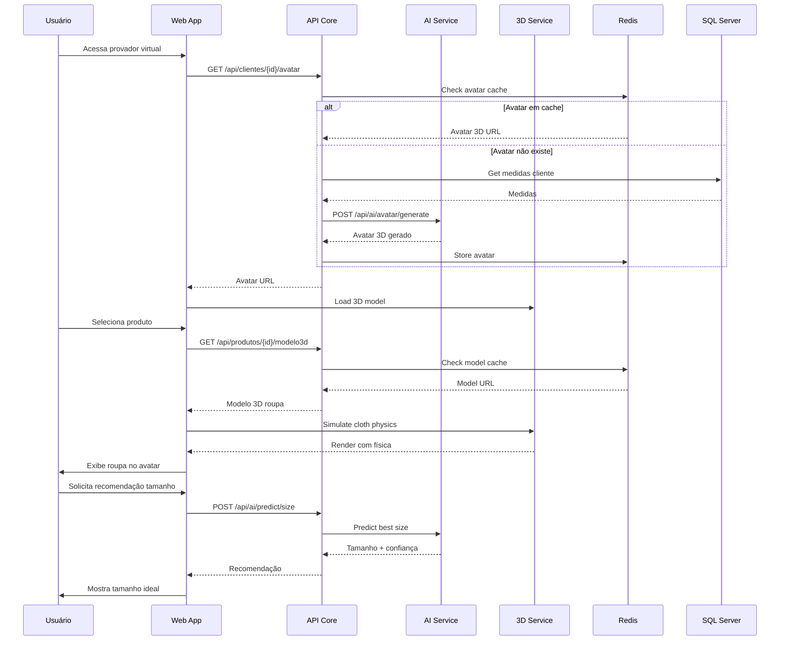

# ??? ARQUITETURA TÉCNICA - Plataforma Barbara

## ?? **VISÃO GERAL DA ARQUITETURA**

```
???????????????????????????????????????????????????????????????????
?  CAMADA DE CLIENTE    ?
???????????????????????????????????????????????????????????????????
?  Web App (Next.js 14)  ?  Mobile App  ?  Admin Panel (React)   ?
?  - Provador Virtual 3D ?  - iOS/Android?  - Dashboard Analytics?
?  - AR Experience       ?  - Camera AR  ?  - Gestão de Produtos ?
?  - Social Fitting      ?  - Push Notif ?  - Relatórios   ?
???????????????????????????????????????????????????????????????????
     ?       ?  ?
   ????????????????????????????????????????
        ?
      ???????????????????????????
           ?      API Gateway ?
     ?   (Azure API Mgmt)    ?
                ?  - Rate Limiting        ?
     ?  - Auth/OAuth2          ?
         ?  - Load Balancing       ?
        ???????????????????????????
      ?
      ???????????????????????????????????????????????????
        ?      ?           ?
??????????????????     ???????????????????     ???????????????????
?   API Core     ?     ?  AI Services    ?     ?  3D Services    ?
? (ASP.NET Core) ?     ? (Python FastAPI)?     ?  (Node.js)  ?
?????????????????? ???????????????????     ???????????????????
? - Produtos     ?     ? - Avatar Gen    ? ? - Model Process ?
? - Clientes     ?     ? - Size Predict  ?     ? - Physics Sim   ?
? - Pedidos      ?     ? - Body Detect   ?     ? - Texture Gen   ?
? - Pagamentos   ?   ? - Style AI      ?     ? - GLB Optimize  ?
? - NF-e    ?     ? - Image Process ?     ? - CDN Delivery  ?
??????????????????     ???????????????????     ???????????????????
   ?   ?       ?
  ?????????????????????????????????????????????????
    ?
         ?????????????????????????
              ? Message Bus   ?
               ?    (RabbitMQ)         ?
        ?  - Event Streaming    ?
       ?  - Async Processing   ?
       ?????????????????????????
          ?
        ?????????????????????????????????????????????????
     ?   ?           ?
??????????????????    ???????????????????    ???????????????????
?   SQL Server   ?    ?  Redis Cache    ?    ?  Blob Storage   ?
?  - Relational  ?    ?  - Sessions     ?    ?  - Images       ?
?  - EF Core     ?    ?  - Avatar Cache ?    ?  - 3D Models    ?
?  - Migrations  ?    ?  - Hot Data     ?    ?  - Videos       ?
??????????????????  ???????????????????    ???????????????????
```

---

## ?? **CAMADA DE APRESENTAÇÃO**

### **Web Application (Next.js 14)**

**Responsabilidades:**
- Interface principal do cliente
- Provador virtual 3D
- Experiência AR
- Social fitting room
- Checkout e pagamento

**Tecnologias:**
- Next.js 14 (App Router)
- TypeScript
- Babylon.js / Three.js (WebGPU)
- TailwindCSS
- Zustand (State)
- React Query (Data fetching)
- WebRTC (Social features)

**Estrutura de Pastas:**
```
/src
  /app
    /(customer)
      /catalog       # Catálogo de produtos
      /virtual-try-on   # Provador virtual
      /ar-experience    # Experiência AR
      /social-room      # Sala social
      /checkout         # Finalização
      /my-closet    # Guarda-roupa
    /(admin)
      /dashboard        # Dashboard gerencial
      /products         # Gestão de produtos
      /orders           # Gestão de pedidos
  /analytics    # Analytics
  /components
    /3d       # Componentes 3D
    /ar # Componentes AR
    /ui     # Componentes UI
  /lib
    /api     # Client API
 /hooks# Custom hooks
    /utils             # Utilidades
  /services
    /avatar         # Serviço de avatar
    /fitting        # Serviço de provador
    /physics           # Física de tecidos
```

---

## ?? **CAMADA DE API**

### **API Core (ASP.NET Core 9)**

**Arquitetura:** Clean Architecture + CQRS

**Estrutura:**
```
/src
  /Barbara.Domain        # Camada de domínio
    /Entities        # Entidades
 /ValueObjects           # Objetos de valor
    /Enums    # Enumerações
    /Interfaces       # Contratos
 
  /Barbara.Application      # Lógica de aplicação
    /Commands           # CQRS Commands
    /Queries  # CQRS Queries
    /DTOs           # Data Transfer Objects
    /Mappings # AutoMapper profiles
/Validators  # FluentValidation
    /Services      # Services de aplicação
    
  /Barbara.Infrastructure   # Infraestrutura
    /Data      # EF Core DbContext
    /Repositories  # Implementação de repos
  /ExternalServices       # APIs externas
      /Payment              # Mercado Pago, PagSeguro
      /NFe          # Focus NFe, Bling
      /Shipping             # Correios, Melhor Envio
  /Storage       # Azure Blob
    /Messaging        # RabbitMQ
    
  /Barbara.API  # Camada de apresentação
  /Controllers     # REST Controllers
    /Hubs           # SignalR Hubs
    /Middlewares            # Custom middlewares
    /Filters             # Action filters
```

**Endpoints Principais:**

```http
# Autenticação
POST   /api/auth/register
POST   /api/auth/login
POST   /api/auth/refresh
POST   /api/auth/logout

# Clientes
GET    /api/clientes/{id}
PUT /api/clientes/{id}
POST   /api/clientes/{id}/avatar
GET    /api/clientes/{id}/medidas

# Produtos
GET    /api/produtos
GET    /api/produtos/{id}
POST   /api/produtos
PUT    /api/produtos/{id}
DELETE /api/produtos/{id}
POST   /api/produtos/{id}/imagens
POST   /api/produtos/{id}/modelo3d

# Catálogo
GET    /api/catalogo/search
GET    /api/catalogo/filtros
GET    /api/catalogo/recomendacoes

# Carrinho
GET    /api/carrinho
POST   /api/carrinho/itens
DELETE /api/carrinho/itens/{id}
PUT    /api/carrinho/itens/{id}

# Pedidos
GET    /api/pedidos
GET    /api/pedidos/{id}
POST   /api/pedidos
GET    /api/pedidos/{id}/rastreamento

# Pagamentos
POST   /api/pagamentos/criar
POST   /api/pagamentos/{id}/confirmar
GET    /api/pagamentos/{id}/status

# Nota Fiscal
POST   /api/nfe/emitir
GET    /api/nfe/{id}/status
GET    /api/nfe/{id}/pdf

# Envio
POST   /api/envio/calcular-frete
POST   /api/envio/{id}/agendar-coleta
GET    /api/envio/{id}/etiqueta
```

---

### **AI Services (Python FastAPI)**

**Responsabilidades:**
- Processamento de imagens
- Geração de avatares
- Detecção de corpo
- Previsão de tamanho
- Análise de estilo

**Estrutura:**
```
/ai-services
  /app
/routers
      /avatar.py          # Geração de avatar
   /detection.py       # Detecção de corpo
      /prediction.py      # Previsão de tamanho
      /style.py       # Análise de estilo
    /models
      /yolo               # YOLO v8
      /size_predictor     # ML de tamanho
    /style_classifier   # Classificador de estilo
    /services
      /image_processor.py
 /avatar_generator.py
      /measurement_extractor.py
    /schemas          # Pydantic schemas
    /config           # Configurações
```

**Endpoints AI:**

```http
# Avatar
POST   /api/ai/avatar/generate
POST   /api/ai/avatar/update-measurements
GET    /api/ai/avatar/{id}/model

# Detecção
POST   /api/ai/detect/body
POST   /api/ai/detect/measurements
POST   /api/ai/detect/pose

# Previsão
POST   /api/ai/predict/size
POST   /api/ai/predict/fit
GET    /api/ai/predict/recommendations

# Estilo
POST   /api/ai/style/analyze
GET    /api/ai/style/suggestions
POST   /api/ai/style/outfit-generator
```

**Modelos de ML:**

1. **Body Detection (YOLO v8)**
   - Input: Imagem (frente + lado)
   - Output: Keypoints do corpo
   - Precisão: 95%+
   
2. **Size Prediction (Custom CNN)**
   - Input: Medidas + histórico
   - Output: Tamanho + confiança
   - Treinamento: Online learning
   
3. **Style Classifier (Transfer Learning - ResNet50)**
   - Input: Histórico de compras
   - Output: Perfil de estilo
   - Classes: Clássico, Moderno, Boho, Sporty, etc.

---

### **3D Services (Node.js)**

**Responsabilidades:**
- Processamento de modelos 3D
- Otimização de assets
- Geração de texturas
- Simulação de física

**Estrutura:**
```
/3d-services
  /src
    /controllers
      /model-processing.ts
   /texture-generation.ts
 /physics-simulation.ts
    /services
      /blender-api.ts      # Integração com Blender
      /gltf-optimizer.ts   # Otimização GLB/GLTF
/physics-engine.ts   # NVIDIA PhysX
    /workers
      /model-converter.ts  # Background jobs
      /texture-baker.ts
```

**Endpoints 3D:**

```http
# Modelos
POST   /api/3d/models/upload
POST   /api/3d/models/{id}/optimize
GET    /api/3d/models/{id}/download
POST   /api/3d/models/{id}/variants

# Texturas
POST   /api/3d/textures/generate
GET    /api/3d/textures/{id}
POST   /api/3d/textures/apply

# Física
POST   /api/3d/physics/simulate
GET    /api/3d/physics/materials
POST   /api/3d/physics/cloth-config
```

---

## ?? **CAMADA DE DADOS**

### **SQL Server (Banco Principal)**

**Modelo de Dados:**

```sql
-- Já implementado nas entidades C#
Tables:
- Clientes
- Enderecos
- Produtos
- Categorias
- ImagensProdutos
- EstoqueProdutos
- Pedidos
- ItensPedido
- Pagamentos
- NotasFiscais
- Envios
- Configuracoes

-- Novas tabelas para IA
- Avatares
- MedidasClientes
- HistoricoPredições
- FeedbackTamanho
- PerfilEstilo
```

**Particionamento:**
- Pedidos: Por ano
- Avatares: Por região
- Analytics: Por mês

**Índices Críticos:**
```sql
-- Performance
CREATE INDEX IX_Produtos_CategoriaId_Ativo ON Produtos(CategoriaId, Ativo);
CREATE INDEX IX_Pedidos_ClienteId_Status ON Pedidos(ClienteId, Status);
CREATE INDEX IX_EstoqueProduto_ProdutoId_Quantidade ON EstoqueProdutos(ProdutoId, Quantidade);

-- Busca
CREATE FULLTEXT INDEX ON Produtos(Nome, Descricao);
```

---

### **Redis (Cache & Sessions)**

**Uso:**

```redis
# Sessions
SET session:{sessionId} {userData} EX 3600

# Avatar Cache
SET avatar:{clienteId}:model {3dModelUrl} EX 86400
SET avatar:{clienteId}:measurements {medidasJson} EX 86400

# Product Cache
SET product:{produtoId} {produtoJson} EX 3600
SET products:catalog:page:{n} {listaProdutos} EX 1800

# Size Predictions
SET size:prediction:{clienteId}:{produtoId} {tamanhoRecomendado} EX 7200

# Hot Data
ZADD trending:products {timestamp} {produtoId}
ZADD popular:searches {count} {searchTerm}
```

**Estratégia de Cache:**
- Write-through para dados críticos
- Cache-aside para leituras
- TTL dinâmico baseado em acesso
- Invalidação por eventos

---

### **Azure Blob Storage**

**Containers:**

```
/images
  /produtos
    /{produtoId}
      /original
      /thumbnails
      /webp
  /avatares
    /{clienteId}
      /photos
    /generated

/models
  /3d
    /{produtoId}
      /original.fbx
      /optimized.glb
      /variants

/documents
  /nfe
    /{pedidoId}
      /xml
   /pdf
  /etiquetas
    /{envioId}.pdf

/cache
  /renders   # Pre-rendered views
  /thumbnails       # Generated thumbs
```

**CDN Config:**
- Cache-Control: max-age=31536000 (assets imutáveis)
- Gzip/Brotli compression
- Image optimization automática
- Lazy loading

---

## ?? **INTEGRAÇÃO & MENSAGERIA**

### **RabbitMQ (Message Bus)**

**Exchanges & Queues:**

```
# E-commerce Flow
Exchange: barbara.orders
  Queue: orders.created
  Queue: orders.payment-confirmed
  Queue: orders.shipped
  
# AI Processing
Exchange: barbara.ai
  Queue: ai.avatar-generation
  Queue: ai.size-prediction
  Queue: ai.image-processing
  
# Notifications
Exchange: barbara.notifications
  Queue: notifications.email
  Queue: notifications.sms
  Queue: notifications.push
  
# Analytics
Exchange: barbara.events
  Queue: analytics.user-behavior
  Queue: analytics.product-views
  Queue: analytics.conversions
```

**Padrões de Mensageria:**

1. **Event Sourcing** para pedidos críticos
2. **Publish-Subscribe** para notificações
3. **Work Queue** para processamento pesado
4. **RPC** para síncronas críticas

---

## ?? **SEGURANÇA**

### **Autenticação & Autorização**

**JWT Tokens:**
```json
{
  "sub": "clienteId",
  "email": "cliente@email.com",
  "role": "customer",
  "avatar_id": "avatar-uuid",
  "iat": 1699999999,
  "exp": 1700003599
}
```

**OAuth 2.0 + OpenID Connect:**
- Google Login
- Facebook Login
- Apple Sign In

**Políticas de Autorização:**
```csharp
[Authorize(Policy = "CustomerOnly")]
[Authorize(Policy = "AdminOnly")]
[Authorize(Policy = "CanManageProducts")]
```

### **Proteções**

- Rate Limiting: 100 req/min por IP
- CORS configurado
- HTTPS obrigatório
- Anti-CSRF tokens
- SQL Injection protection (EF Core)
- XSS protection (sanitização)
- PII encryption (LGPD compliant)

---

## ?? **OBSERVABILIDADE**

### **Monitoramento**

**Application Insights:**
- Performance metrics
- Exception tracking
- Custom events
- User flows

**Prometheus + Grafana:**
- Infrastructure metrics
- Container health
- Queue depth
- Cache hit rates

### **Logging**

**Serilog (Structured Logging):**
```csharp
Log.Information("Avatar generated for {ClienteId} in {Duration}ms", 
    clienteId, duration);

Log.Error(exception, "Payment failed for {PedidoId}", pedidoId);
```

**Log Levels:**
- Verbose: 3D rendering details
- Debug: AI predictions
- Information: Business events
- Warning: Slow queries
- Error: Failures
- Fatal: System down

### **Alertas**

```yaml
Alerts:
  - HighErrorRate: > 5% em 5min
  - SlowResponses: P95 > 1s
  - LowCacheHitRate: < 70%
  - QueueBacklog: > 1000 msgs
  - DatabaseDown: Connection failed
```

---

## ?? **DEPLOYMENT & CI/CD**

### **Ambientes**

```
Development  ? localhost / dev.barbara.com.br
Staging      ? staging.barbara.com.br
Production   ? www.barbara.com.br
```

### **Pipeline (GitHub Actions)**

```yaml
on: push to main

Jobs:
  1. Build & Test
     - dotnet test
     - npm test
     - pytest (AI services)
     
  2. Code Quality
     - SonarQube scan
     - Security scan (Snyk)
     - Lint
     
  3. Build Images
- Docker build
     - Push to ACR
  
  4. Deploy to Staging
     - Helm upgrade
     - Smoke tests
     
  5. Deploy to Production
     - Blue-Green deployment
     - Canary release (10% ? 100%)
     - Rollback if errors
```

### **Infrastructure as Code**

**Terraform:**
```hcl
# Azure Resources
- App Services
- SQL Database
- Redis Cache
- Blob Storage
- CDN
- Application Insights
- AKS Cluster (future)
```

---

## ?? **ESCALABILIDADE**

### **Estratégias**

**Horizontal Scaling:**
- API Core: Auto-scale 2-20 instances
- AI Services: GPU instances on-demand
- 3D Services: Worker pool (4-40)

**Vertical Scaling:**
- SQL Server: Scale up em black friday
- Redis: Memory optimization

**Database Scaling:**
- Read replicas para queries pesadas
- Sharding por região (futuro)
- CQRS: Reads separados de Writes

**CDN & Edge:**
- Cloudflare / Azure Front Door
- Edge caching agressivo
- Static assets em 150+ POPs

---

## ?? **TESTES**

### **Pirâmide de Testes**

```
         /\
        /E2E\        10% - Cypress (fluxos críticos)
       /??????\
      /  API  \    30% - xUnit (integration tests)
/??????????\
/   Unit     \   60% - xUnit (unit tests)
   /??????????????\
```

**Cobertura Mínima:**
- Domain: 90%+
- Application: 80%+
- Controllers: 70%+
- Total: 80%+

### **Performance Tests**

**k6 / Artillery:**
```javascript
// Load test
- 1000 usuários simultâneos
- 50 req/s por 30min
- P95 < 500ms
- Erro < 0.1%
```

---

## ?? **DIAGRAMA DE SEQUÊNCIA - Provador Virtual**



---

**Última atualização:** 08/11/2025  
**Versão:** 1.0  
**Arquiteto:** Barbara Tech Team
